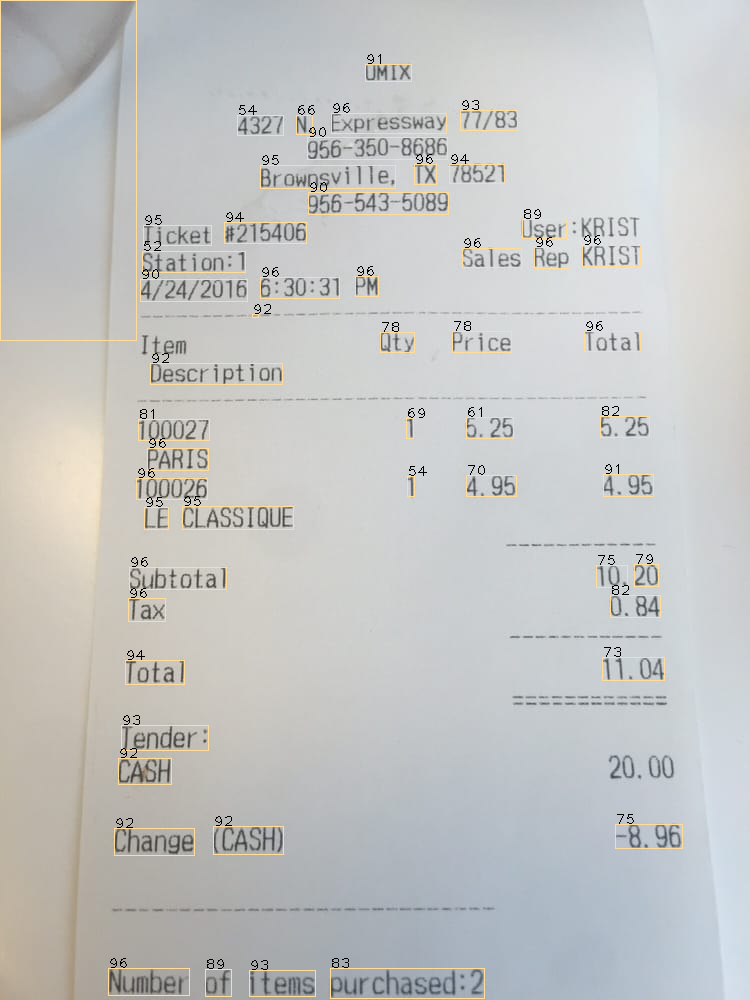

# Ocular
Semi-Automated Document classification and data processing using Artificial Intelligence.

The main objective of this project is to develop a solution for automatically extracting information from scanned documents such as receipts, bills, invoices, etc. Overcoming the inherent unstructured nature of these invoices is one of the main goals of this project.

The output below is obtained by implementing various computer vision pre-processing algorithms and further combining it with Tesseract OCR from pyocr library.

Output sparse text-

UMIX
4327 N. Expressway 77/83
956-350-8686
Brownsville, TX 7852
966-543-5089
Ticket #215406 User :KRIST
Station:1 Sales Rep KRIST
4/24/2016 | 6:30:31 PM
Ite Qty Price Total
Description
100027 1 6.25 §.25
PARIS
100026 1 4.95 4.96
LE CLASSIQUE
Subtotal 10. 20
Tax 0.84
; Total 11.04
Tender:
CAGH 20,00
~8.96
Change (CASH)
7 Number of items purchased:2

